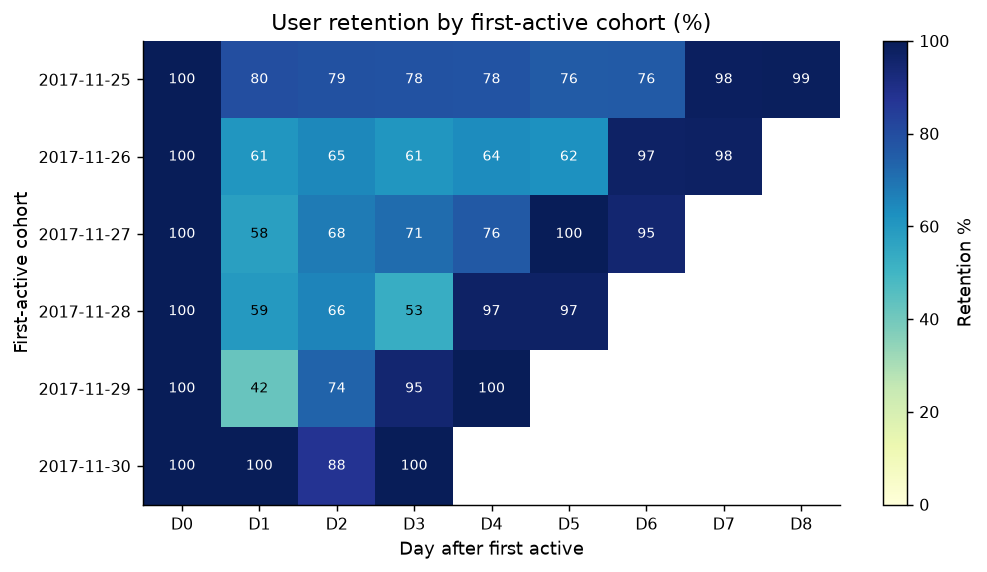
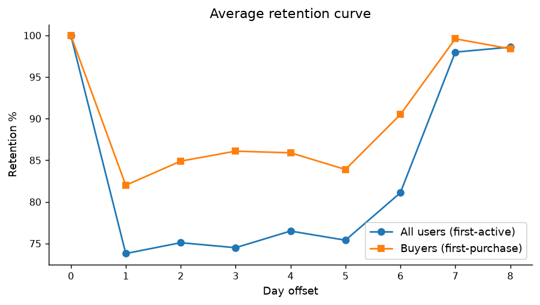
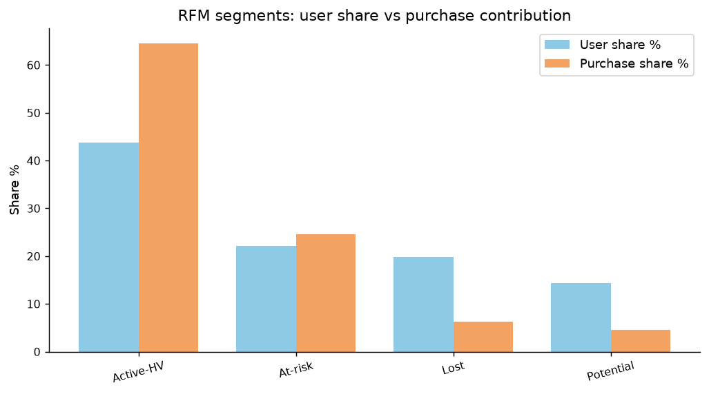
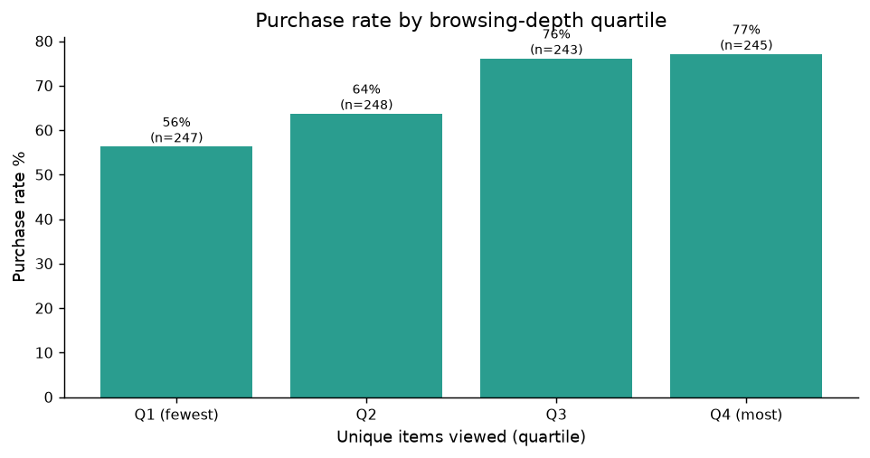
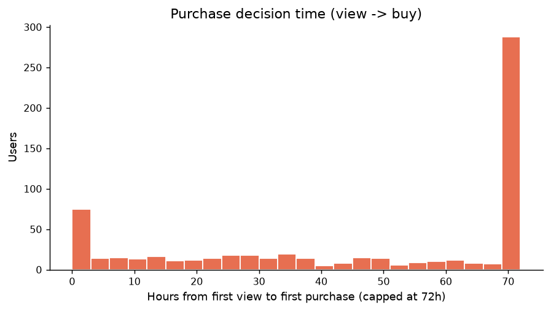
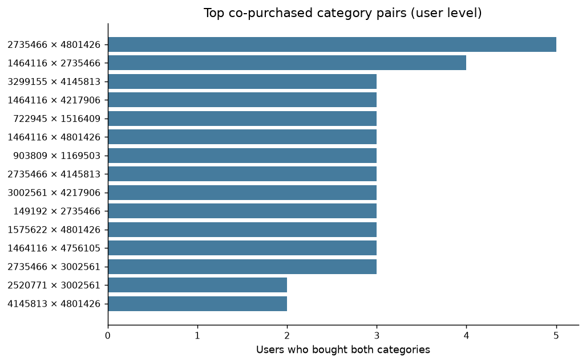

# 淘宝用户行为端到端分析（复现 + 创新升级）

基于阿里天池 **UserBehavior 公开数据集**（约 1 亿条行为日志）的电商用户行为端到端分析项目：从数据清洗、SQL/Python 分析、业务洞察到可视化看板全链路覆盖，并在复现开源项目的基础上新增 **Cohort 留存、RFM 分层、行为深度×转化、跨品类捆绑机会** 4 个创新分析模块。

> 定位：数据分析师 / 商业分析师 / 数据运营 / 产品运营方向作品集项目
> 关联技能：Python · Pandas · SQL · 可视化 · 业务口径设计

---

## 项目亮点

- **真实公开数据**：天池 UserBehavior 抽样 10 万行，清洗后 **99,956 条有效记录 / 983 用户 / 9 天窗口 / 4 类行为（浏览→收藏→加购→购买）**；
- **端到端链路**：数据清洗 → SQL 指标分析 → 转化漏斗 → 图表/报告 → Excel 看板，全程可复现；
- **口径严谨**：区分"用户级转化率"与"用户-商品级顺序转化率"两套口径，避免单一指标误判业务；
- **创新升级**：新增 cohort 留存、RFM 分层、行为深度与决策时长、跨品类捆绑 4 个模块（原项目未覆盖），并输出面向运营动作的业务建议。

---

## 交互看板（Streamlit）

📊 **《淘宝用户价值分层与召回策略工具》**：在分析结果之上构建的决策型看板，围绕
"识别高价值用户 → 发现流失风险 → 召回/运营策略 → 指标验证" 的故事线，包含
流失预警召回工作台、Cohort 留存（含口径陷阱说明）、行为×转化、捆绑机会 5 个页面。

```bash
pip install -r streamlit_app/requirements.txt
streamlit run streamlit_app/app.py
```

代码与页面说明见 [`streamlit_app/`](streamlit_app/)。

## 数据来源与口径

| 字段 | 说明 |
|---|---|
| user_id / item_id / category_id | 脱敏后的用户 / 商品 / 品类 ID |
| behavior_type | pv(浏览) / fav(收藏) / cart(加购) / buy(购买) |
| timestamp | Unix 时间戳（已转换为 Asia/Shanghai 业务时间） |

- 原始数据：约 1 亿条，时间范围 2017-11-25 ~ 2017-12-03（[天池](https://tianchi.aliyun.com/dataset) / Kaggle 镜像可下载）；
- 本仓库使用**抽样 10 万行**版本（`data/raw_user_behavior_sample.csv`），清洗后保留 99,956 行，适合本地快速复现；
- ⚠️ 样本为"已产生行为的用户"，转化率/回访率等绝对值偏高，分析重点看**组间相对差异**与**结构**，不作为平台全量真实水平。

---

## 快速开始

```bash
# 1) 创建环境（任选）
conda create -n portfolio python=3.11 -y && conda activate portfolio
# 或 python3 -m venv venv && source venv/bin/activate

# 2) 安装依赖
pip install -r requirements.txt

# 3) 复现原项目全流程
python src/data_cleaning.py --input data/raw_user_behavior_sample.csv --output data/cleaned_user_behavior.csv
python src/analysis.py      --input data/cleaned_user_behavior.csv
python src/generate_reports.py

# 4) 运行创新升级模块（本项目新增）
python src/upgrade_analysis.py --input data/cleaned_user_behavior.csv

# 5) 测试
python -m pytest
```

运行后产物：
- 报告：`reports/upgrade_summary.md` 及 4 份分模块报告 `reports/upgrade_*.md`
- 图表：`reports/figures/upgrade_*.png`（共 6 张）
- 明细表：`reports/tables/upgrade_*.csv`（RFM 分层 / 浏览深度 / 复购 / 捆绑）

---

## 复现内容（继承自原开源项目）

- 用户级与用户-商品级双口径转化漏斗
- 行为类型分布、DAU、每日购买趋势
- 小时活跃热力图（Asia/Shanghai 口径）
- Top 购买品类与品类级转化
- 复购率、高价值用户、加购未付款再营销人群
- Excel 看板（`dashboard/taobao_behavior_dashboard.xlsx`）

---

## 创新升级模块（本次新增）

### 1️⃣ Cohort 留存分析
首次活跃 / 首次购买队列的逐日回访矩阵与曲线，并补充**窗口内复购率**（口径更贴近 GMV 的稳健指标）。




### 2️⃣ RFM 用户分层（R/F 双维）
无金额字段故不含 M（已在报告中说明口径），按 R/F 打分并聚为 4 类，输出**人数占比 vs 购买贡献占比**：

| 分层 | 人数占比 | 购买贡献 |
|---|---|---|
| 高价值活跃（近期高频） | 43.8% | **64.5%** |
| 流失预警（沉默高频） | 22.1% | 24.6% |
| 沉默长尾（沉默低频） | 19.8% | 6.3% |
| 潜力客户（近期低频） | 14.3% | 4.6% |



### 3️⃣ 行为深度 × 转化 + 购买决策时长
- **购买用户浏览中位数 60 个商品 vs 未购买用户 40 个**，加购商品数 6.2 vs 3.6 → "多看多比"是强购买信号；
- 浏览深度四分位购买率 **56.3% → 77.1%** 单调上升；
- **73.2% 的购买发生在首次浏览 24 小时之后**，仅 9.3% 在 1 小时内完成 → 比价/决策型用户为主。




### 4️⃣ 跨品类连带购买（捆绑机会）
无订单 ID 的局限下，用**用户级品类共现**识别"易连带购买"的品类对，输出 Top15 组合与条件概率 P(B|A)，服务详情页交叉推荐与组合装（Case Pack）策略。



---

## 主要发现与业务建议

| 发现 | 建议动作 |
|---|---|
| 高价值活跃用户 43.8% 贡献 64.5% 购买 | 会员权益 / 新品优先购 / 复购激励 |
| 流失预警用户占 22.1%、购买贡献 24.6% | 高价值挽回：专属折扣 + 定向召回 |
| 浏览→加购是漏斗最薄弱环节 | 详情页优化、价格锚点、个性化推荐 |
| 购买决策以 24h+ 为主（73.2%） | 购物车/收藏提醒 + 降价提醒多轮触达 |
| 购买用户浏览/加购深度显著更高 | 浏览 20~50 商品未加购时触发"相似款对比" |

---

## 项目结构

```
taobao-user-behavior-analysis/
├── data/                 # 原始样本与清洗后数据
├── notebooks/            # EDA Notebook
├── sql/                  # PostgreSQL SQL 指标分析
├── src/                  # 清洗 / 分析 / 报告 / 升级模块脚本
│   └── upgrade_analysis.py   # ★ 创新升级模块（新增）
├── reports/              # 报告、图表、明细表
├── dashboard/            # Excel 看板
├── tests/                # 单元测试
├── requirements.txt
└── README.md
```

---

## 口径与局限（面试准备）

- **样本**：10 万行抽样，非平台全量；行为加权抽样会高估重度用户占比；
- **留存**：行为日志无注册信息，"留存"= 回访（任意行为）；D7/D8 抬升为**周末效应**（12/2-12/3 周六日），非真实留存改善；
- **RFM**：无金额字段 → 仅 R/F，接入订单金额后可补 M 与客单价分析；
- **捆绑**：无订单/会话 ID → 用户级品类共现是候选信号，落地需订单级数据验证；
- **结论导向**：每个发现都配套"可执行动作 + 可验证指标"，避免只罗列数字。

---

## 致谢与归属

- 数据：阿里天池公开数据集 **UserBehavior**；
- 本项目复现并升级自开源项目 [bluesblue320-hue/Taobao-User-Behavior-Conversion-Analysis](https://github.com/bluesblue320-hue/Taobao-User-Behavior-Conversion-Analysis)，原项目未提供 LICENSE，本仓库用于个人学习与求职作品集展示，如有版权问题请联系作者删除。

---

## 作者

Xuefei Wang · 数据分析 / 商业分析方向 · [GitHub](https://github.com/Ashely-sudo)
